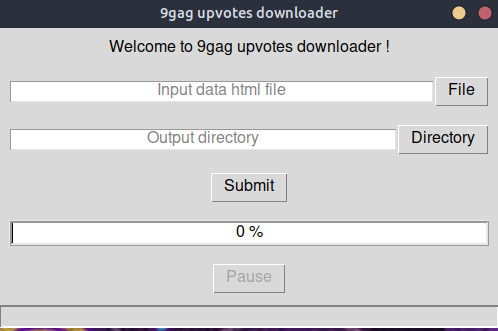
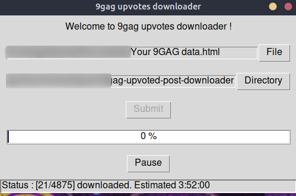

# 9gag upvoted posts downloader


This projects helps nostalgic 9gaggers retrieving and downloading old upvoted memes.Written in Python 3.8.5

## Screenshots





## Execution

### Download project

You can either download the source and run

```
pipenv install

```

And then run 
```
pyinstaller --onefile --windowed window.py
```
And execute the file window in /dist

or you can download the executable directly from Release 


### Get Posts ids list

According to GDPR, all websites detaining personal information about you can be asked to give the user's all the data they detain about them. Thus, we have first to ask 9gag the list of all the data they have about your profile. 

 - Connect to your 9gag acount on your desktop.
 - Click on your profile picture > Settings >Privacy & Safety > Request my data.

Within minutes, you will receive a mail from 9gag. Download the file "You 9gag data.html"


### Download your upvoted posts

1. Enter your html data file in the first input
2. Enter your output directory
3. Click Submit


That's all folks ! Your memes will be downloaded in the chosen directory. 
**If you do not trust the file processing, feel free to remove the first part of the html file containing your pseudo and mail.** 
I absolutely take no information from the users. Privacy first ! 

### Advice needed
By implementing pyinstaller in Pipfile, compiled version went from 10Mo to 88Mo, if you know how to reduce binary size, feel free to give your advice !

